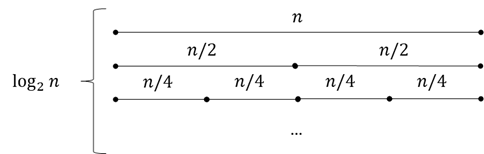

# Sort

Given a list of numbers, sort them in ascending/descending order.

## Quick Sort

Divide and conquer.

Give a sequence of numbers from the array `q`. Let the start index is `l` and the end index is `r`.

- Pick a pivot `q[l]`, `q[r]`, `q[(l+r)/2]`, or `q[random]`.
- Partition the array into two parts, one part is smaller than or equal to the pivot, the other part is larger than or equal to the pivot. **The most difficult part**.
- Recursively sort the two parts.

### Rudimentary Partition

- Let's create another 2 array, `smaller` and `larger`.
- And then iterate through the array `q`, if the number is smaller than the pivot, put it into `smaller`, otherwise put it into `larger`.
- Finally, concatenate `smaller`, `pivot`, and `larger` (by copying the elements from `smaller` and `larger` to `q`).

The above method has time complexity of $O(n)$ and space complexity of $O(n)$. Using 2 pointers to do the partitioning, can achieve better space complexity.

### Partition with 2 pointers

- Let's create 2 pointers, `i` and `j`.
- Move `i` from `l` to `r`, and move `j` from `r` to `l`. Continue as long as `i` and `j` do not cross each other and `q[i] < pivot` and `q[j] > pivot`.
- Exchange `q[i]` and `q[j]`. Move `i` and `j` to the next position.
- Continue the above 2 steps until `i` and `j` cross each other.

Just to make it make sense, let's think about it.

- For all numbers left to `i`, they are smaller than the pivot.
- For all numbers right to `j`, they are larger than the pivot.
- Hence, when you concatenate, they must be in the right order.
- Unstable sorting algorithm. An algorithm is considered unstable if it does not preserve the relative order of elements with equal keys.
### Example

#### Basic Sort

Sort a list of numbers.

```cpp
void qsort(int q[], int l, int r)
{
    if (l >= r)
        return;

    int x = q[(l + r) / 2], i = l - 1, j = r + 1;
    while (i < j)
    {
        while (q[++i] < x)
            ;
        while (q[--j] > x)
            ;
        if (i < j)
            swap(q[i], q[j]);
    }
    qsort(q, l, j);
    qsort(q, j + 1, r);
}
```

- Time complexity: $O(n\log{n})$
  - This is the average time complexity, in which, the array on average split into 2 equal parts.
  - . 
  - The worst case is $O(n^2)$.
- The pivot choice is delicate. If we choose to use `j` as an argument in the recursion, then one must not use `r` as the pivot; similarly, if we choose to use `i` as an argument in the recursion, then one must not use `l` as the pivot. For example:
  - Let's assume the input is `[1, 2]`, and we choose `x = q[r]`.
  - Then, after the first iteration, `i = 1` and `j = 1`. Nothing changed, and the loop is terminated. Then, `qsort(q, 0, 1)` and `qsort(2, 2)` is called. And one would soon realize, that`qsort(q, 0, 1)` is exactly the same as what we called initially, and infinite recursion occurs.void  qsort(int  q[], int  l, int  r){ if (l  >=  r) return;
 int  x  =  q[(l  +  r) /  2], i  =  l  -  1, j  =  r  +  1; while (i  <  j)    { while (q[++i] <  x)            ; while (q[--j] >  x)            ; if (i  <  j) swap(q[i], q[j]);    } qsort(q, l, j); qsort(q, j  +  1, r);}
- If one wants to use `i` instead of `j` in the recursion call, simply change to:

```cpp
qsort(q, l, i - 1);
qsort(q, i, r);
```

#### Quick Selection

Find the $k$-th smallest number in an array.

```cpp
#include <iostream>

using namespace std;

const int N = 1e6 + 10;
int n, k;
int q[N];

int qsel(int q[], int l, int r, int k) {
    if (l >= r) return q[l];
    int x = q[l + r >> 1], i = l - 1, j = r + 1;
    while (i < j) {
        while (q[++i] < x) {}
        while (q[--j] > x) {}
        if (i < j) swap(q[i], q[j]);
    }
    int s = j - l + 1;                        // number of elements in left
    if (k <= s) { return qsel(q, l, j, k); }  // only sort left part
    else                                      // or, if k is larger than pivot, right part
        return qsel(q, j + 1, r, k - s);      // ∴ O(n) n × (1 + 1/2 + …)  = 2n
}

int main() {
    cin >> n >> k;
    for (int i = 0; i < n; i++) cin >> q[i];
    cout << qsel(q, 0, n - 1, k) << endl;
}
```

- Time complexity: $O(n)$. This is because, in each layer of recursion, we only sort one part of the array, and the other part is discarded. Hence, the time complexity is $O(n) + O(n/2) + O(n/4) + … = O(n)$.
    - The worst case is $O(n^2)$.
- Space complexity: $O(1)$
## Merge Sort

Divide and conquer. This time, we don't use a pivot, but rather, the midpoint.

- The first recursion is the sorting of a list of numbers into sorting the number of the left and right. After a sufficient amount of recursion, we will have a list of 1 element, and we start to return.
- Then, merge the two sorted lists. **The most difficult part**\*\*.
  - Copy the array into another array.
  - Use two pointers to iterate through the left and right array, and compare the elements. Put the smaller one into the original array.
    - In all situations, the smallest element is \`min(l\[0\], r\[0\]), because, after the previous step, the left and right arrays are already sorted.
    - Hence, the smallest element among the rest of the elements is always copied back to the original array.
    - Finally, copy whatever is left in the left or right array to the original array.
- The time complexity is $O(n\log{n})$, and the space complexity is $O(n)$.
  -   
  - For an array with a size of $n$, it takes $\log{n}$ steps to divide the array into 1-element arrays. And for each step, it takes $n$ time to merge the two arrays. Hence, the time complexity is $O(n\log{n})$.
- Stable sorting algorithm. An algorithm is considered stable if it preserves the relative order of elements with equal keys.


```cpp
void msort(int q[], int l, int r)
{
    if (l >= r)
        return;
    int mid = l + r >> 1;

    msort(q, l, mid);
    msort(q, mid + 1, r);

    int k = 0, i = l, j = mid + 1;
    // merge
    while (i <= mid && j <= r)
    {
        if (q[i] <= q[j])
            tmp[k++] = q[i++];
        else
            tmp[k++] = q[j++];
    }
    // left over
    while (i <= mid)
        tmp[k++] = q[i++];
    while (j <= r)
        tmp[k++] = q[j++];
    // copy back
    for (i = l, j = 0; i <= r; i++, j++)
        q[i] = tmp[j];
}
```


# Binary Split

## Integer

For a sequence of elements `E` and a target `k`. If there exists a function `f(e`)` that separates the elements into 2 continuous groups, such that `f(e)` is true for all elements in the first group, and false for all elements in the second group, then we can use binary split to find the threshold such that `f(k-Δ) != f(k+Δ)`.

The above theory is, however, useless. We probably just care about how to updat the `mid`. And the idea is:

- If `l = mid`, that is, we are updating the `mid` to the right, then `mid = (l + r + 1) / 2`.
- If `r = mid`, that is, we are updating the `mid` to the left, then `mid = (l + r) / 2`.

The reason behind such a convention is to handle the situation when `l = r - 1` or `l = r`. In the first case, `mid = (l + r) / 2` will be `l`, and `mid = (l + r + 1) / 2` will be `r`. In the second case, `mid = (l + r) / 2` will be `l`, and `mid = (l + r + 1) / 2` will be `l + 1`. Hence, we can always ensure that `mid` is updated, rather than falling into an infinite loop.

### Example

Find the range of numbers in a sorted array. For example, given array `1 1 2 3` and the user input `1`, the program should produce `0 1`.

```cpp
#include <iostream>

using namespace std;

const int N = 1e6 + 10;

int n, m;
int q[N];

int main()
{
    scanf("%d%d", &n, &m);
    for (int i = 0; i < n; i++)
        scanf("%d", &q[i]);
    while (m--)
    {
        int x;
        scanf("%d", &x);
        // find start
        int l = 0, r = n - 1;
        while (l < r)
        {
            int mid = l + r >> 1;
            if (q[mid] >= x)
                r = mid;
            else
                l = mid + 1;
        }
        if (q[l] != x)
        {
            cout << "-1 -1" << endl;
            continue;
        }
        cout << l << " ";
        l = 0, r = n - 1;
        while (l < r)
        {
            int mid = l + r + 1 >> 1;
            if (q[mid] <= x)
                l = mid;
            else
                r = mid - 1;
        }
        cout << l << endl;
    }
    return 0;
}
```
## Float

A floating point binary search is nice: there are simply no boundary conditions. Usually, we will simply use $\epsilon$ to determine the equality of two floating point numbers.

```cpp
#include <iostream>

using namespace std;

int main()
{
    double x;
    cin >> x;

    double l = 0, r = x;
    while (r - l > 1e-6) // number of precision + 2
    {
        double mid = (l + r) / 2;
        if (mid * mid >= x)
            r = mid;
        else
            l = mid;
    }
    printf("%.2f\n", l); // 2 digits precision
    return 0;
}
```