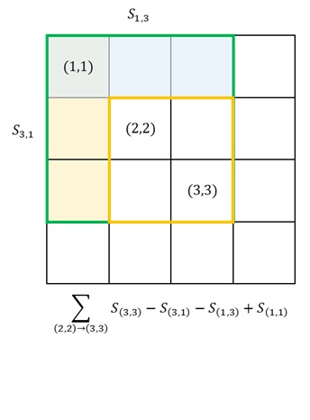
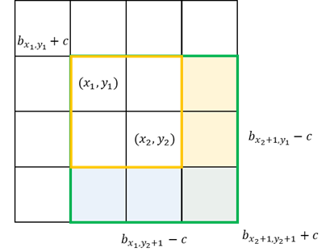

# Sort

Given a list of numbers, sort them in ascending/descending order.

## Quick Sort

Divide and conquer.

Give a sequence of numbers from the array `q`. Let the start index is `l` and the end index is `r`.

- Pick a pivot `q[l]`, `q[r]`, `q[(l+r)/2]`, or `q[random]`.
- Partition the array into two parts, one part is smaller than or equal to the pivot, the other part is larger than or equal to the pivot. **The most difficult part**.
- Recursively sort the two parts.

### Rudimentary Partition

- Let's create another 2 array, `smaller` and `larger`.
- And then iterate through the array `q`, if the number is smaller than the pivot, put it into `smaller`, otherwise put it into `larger`.
- Finally, concatenate `smaller`, `pivot`, and `larger` (by copying the elements from `smaller` and `larger` to `q`).

The above method has time complexity of $O(n)$ and space complexity of $O(n)$. Using 2 pointers to do the partitioning, can achieve better space complexity.

### Partition with 2 pointers

- Let's create 2 pointers, `i` and `j`.
- Move `i` from `l` to `r`, and move `j` from `r` to `l`. Continue as long as `i` and `j` do not cross each other and `q[i] < pivot` and `q[j] > pivot`.
- Exchange `q[i]` and `q[j]`. Move `i` and `j` to the next position.
- Continue the above 2 steps until `i` and `j` cross each other.

Just to make it make sense, let's think about it.

- For all numbers left to `i`, they are smaller than the pivot.
- For all numbers right to `j`, they are larger than the pivot.
- Hence, when you concatenate, they must be in the right order.
- Unstable sorting algorithm. An algorithm is considered unstable if it does not preserve the relative order of elements with equal keys.
### Example

#### Basic Sort

Sort a list of numbers.

```cpp
void qsort(int q[], int l, int r)
{
    if (l >= r)
        return;

    int x = q[(l + r) / 2], i = l - 1, j = r + 1;
    while (i < j)
    {
        while (q[++i] < x)
            ;
        while (q[--j] > x)
            ;
        if (i < j)
            swap(q[i], q[j]);
    }
    qsort(q, l, j);
    qsort(q, j + 1, r);
}
```

- Time complexity: $O(n\log{n})$
  - This is the average time complexity, in which, the array on average split into 2 equal parts.
  - . 
  - The worst case is $O(n^2)$.
- The pivot choice is delicate. If we choose to use `j` as an argument in the recursion, then one must not use `r` as the pivot; similarly, if we choose to use `i` as an argument in the recursion, then one must not use `l` as the pivot. For example:
  - Let's assume the input is `[1, 2]`, and we choose `x = q[r]`.
  - Then, after the first iteration, `i = 1` and `j = 1`. Nothing changed, and the loop is terminated. Then, `qsort(q, 0, 1)` and `qsort(2, 2)` is called. And one would soon realize, that`qsort(q, 0, 1)` is exactly the same as what we called initially, and infinite recursion occurs.void  qsort(int  q[], int  l, int  r){ if (l  >=  r) return;
 int  x  =  q[(l  +  r) /  2], i  =  l  -  1, j  =  r  +  1; while (i  <  j)    { while (q[++i] <  x)            ; while (q[--j] >  x)            ; if (i  <  j) swap(q[i], q[j]);    } qsort(q, l, j); qsort(q, j  +  1, r);}
- If one wants to use `i` instead of `j` in the recursion call, simply change to:

```cpp
qsort(q, l, i - 1);
qsort(q, i, r);
```

#### Quick Selection

Find the $k$-th smallest number in an array.

```cpp
#include <iostream>

using namespace std;

const int N = 1e6 + 10;
int n, k;
int q[N];

int qsel(int q[], int l, int r, int k) {
    if (l >= r) return q[l];
    int x = q[l + r >> 1], i = l - 1, j = r + 1;
    while (i < j) {
        while (q[++i] < x) {}
        while (q[--j] > x) {}
        if (i < j) swap(q[i], q[j]);
    }
    int s = j - l + 1;                        // number of elements in left
    if (k <= s) { return qsel(q, l, j, k); }  // only sort left part
    else                                      // or, if k is larger than pivot, right part
        return qsel(q, j + 1, r, k - s);      // ∴ O(n) n × (1 + 1/2 + …)  = 2n
}

int main() {
    cin >> n >> k;
    for (int i = 0; i < n; i++) cin >> q[i];
    cout << qsel(q, 0, n - 1, k) << endl;
}
```

- Time complexity: $O(n)$. This is because, in each layer of recursion, we only sort one part of the array, and the other part is discarded. Hence, the time complexity is $O(n) + O(n/2) + O(n/4) + … = O(n)$.
    - The worst case is $O(n^2)$.
- Space complexity: $O(1)$
## Merge Sort

Divide and conquer. This time, we don't use a pivot, but rather, the midpoint.

- The first recursion is the sorting of a list of numbers into sorting the number of the left and right. After a sufficient amount of recursion, we will have a list of 1 element, and we start to return.
- Then, merge the two sorted lists. **The most difficult part**\*\*.
  - Copy the array into another array.
  - Use two pointers to iterate through the left and right array, and compare the elements. Put the smaller one into the original array.
    - In all situations, the smallest element is \`min(l\[0\], r\[0\]), because, after the previous step, the left and right arrays are already sorted.
    - Hence, the smallest element among the rest of the elements is always copied back to the original array.
    - Finally, copy whatever is left in the left or right array to the original array.
- The time complexity is $O(n\log{n})$, and the space complexity is $O(n)$.
  -   
  - For an array with a size of $n$, it takes $\log{n}$ steps to divide the array into 1-element arrays. And for each step, it takes $n$ time to merge the two arrays. Hence, the time complexity is $O(n\log{n})$.
- Stable sorting algorithm. An algorithm is considered stable if it preserves the relative order of elements with equal keys.


```cpp
void msort(int q[], int l, int r)
{
    if (l >= r)
        return;
    int mid = l + r >> 1;

    msort(q, l, mid);
    msort(q, mid + 1, r);

    int k = 0, i = l, j = mid + 1;
    // merge
    while (i <= mid && j <= r)
    {
        if (q[i] <= q[j])
            tmp[k++] = q[i++];
        else
            tmp[k++] = q[j++];
    }
    // left over
    while (i <= mid)
        tmp[k++] = q[i++];
    while (j <= r)
        tmp[k++] = q[j++];
    // copy back
    for (i = l, j = 0; i <= r; i++, j++)
        q[i] = tmp[j];
}
```


# Binary Split

## Integer

For a sequence of elements `E` and a target `k`. If there exists a function `f(e`)` that separates the elements into 2 continuous groups, such that `f(e)` is true for all elements in the first group, and false for all elements in the second group, then we can use binary split to find the threshold such that `f(k-Δ) != f(k+Δ)`.

The above theory is, however, useless. We probably just care about how to updat the `mid`. And the idea is:

- If `l = mid`, that is, we are updating the `mid` to the right, then `mid = (l + r + 1) / 2`.
- If `r = mid`, that is, we are updating the `mid` to the left, then `mid = (l + r) / 2`.

The reason behind such a convention is to handle the situation when `l = r - 1` or `l = r`. In the first case, `mid = (l + r) / 2` will be `l`, and `mid = (l + r + 1) / 2` will be `r`. In the second case, `mid = (l + r) / 2` will be `l`, and `mid = (l + r + 1) / 2` will be `l + 1`. Hence, we can always ensure that `mid` is updated, rather than falling into an infinite loop.

### Example

Find the range of numbers in a sorted array. For example, given array `1 1 2 3` and the user input `1`, the program should produce `0 1`.

```cpp
#include <iostream>

using namespace std;

const int N = 1e6 + 10;

int n, m;
int q[N];

int main()
{
    scanf("%d%d", &n, &m);
    for (int i = 0; i < n; i++)
        scanf("%d", &q[i]);
    while (m--)
    {
        int x;
        scanf("%d", &x);
        // find start
        int l = 0, r = n - 1;
        while (l < r)
        {
            int mid = l + r >> 1;
            if (q[mid] >= x)
                r = mid;
            else
                l = mid + 1;
        }
        if (q[l] != x)
        {
            cout << "-1 -1" << endl;
            continue;
        }
        cout << l << " ";
        l = 0, r = n - 1;
        while (l < r)
        {
            int mid = l + r + 1 >> 1;
            if (q[mid] <= x)
                l = mid;
            else
                r = mid - 1;
        }
        cout << l << endl;
    }
    return 0;
}
```
## Float

A floating point binary search is nice: there are simply no boundary conditions. Usually, we will simply use $\epsilon$ to determine the equality of two floating point numbers.

```cpp
#include <iostream>

using namespace std;

int main()
{
    double x;
    cin >> x;

    double l = 0, r = x;
    while (r - l > 1e-6) // number of precision + 2
    {
        double mid = (l + r) / 2;
        if (mid * mid >= x)
            r = mid;
        else
            l = mid;
    }
    printf("%.2f\n", l); // 2 digits precision
    return 0;
}
```

# High Precision

## Storage

To store a high-precision number, we can use an array to store the digits. For example, `12345` can be stored in big-endian as `[1, 2, 3, 4, 5]`, or in little-endian as `[5, 4, 3, 2, 1]`.

## Add

Addition of 2 large integers.

- Store digits in big-endian.
- Use 2 pointers to iterate through the 2 arrays.
  - The result is the sum of the 2 digits plus the carry.
  - The carry is obtained when the sum is greater than 10.
- Finally, add the carry to the result if it is not 0.

```cpp
vector<int> add(vector<int> &A, vector<int> &B) {
    // use pointer to prevent copy
    vector<int> C;

    if (A.size() < B.size()) return add(B, A);

    int t = 0;
    for (int i = 0; i < A.size(); i++) {
        t += A[i];
        if (i < B.size()) t += B[i];
        C.push_back(t % 10);
        t /= 10;  // if larger than 10, 1
    }
    if (t) C.push_back(1);
    return C;
}
```

- Time complexity: $O(n)$
- The algorithm assumes that the input is stored in small-endian. Therefore, it can happily add the digits from the least significant digit to the most significant digit. If the input is stored in big-endian, we need to reverse the input first.

If we want to do better, we can compress the digits into a single integer. For example, `12345` can be stored as `[123, 45]`. 

## Sub

Subtraction of 2 large integers. If `A < B`, return `-sub(B, A)`.

```cpp
vector<int> sub(vector<int> &A, vector<int> &B) {
    vector<int> C;
    for (int i = 0, t = 0; i < A.size(); i++) {
        t = A[i] - t;
        if (i < B.size()) t -= B[i];
        C.push_back((t + 10) % 10);  // (t < 0)? t + 10: t. Notice if t >= 0, (t + 10) % 10 == t
        t = (t < 0) ? 1 : 0;         // if we need to get 1 off from previous 1.
    }

    while (C.size() > 1 && C.back() == 0) {
        C.pop_back();  // remove 0 follows, but keep 0 if 0 is answer.
    }
    return C;
}
```

- Time complexity: $O(n)$
- This algorithm assumes big-endian and `A > B`. If this is not the case, we need to reverse the input first.

```cpp
// return negative if A < B, 0 if A == B, positive if A > B
int cmp(vector<int> &A, vector<int> &B) {
    if (A.size() != B.size()) return A.size() > B.size();
    int i = 0, sz = A.size();
    for (int i = sz; i >= 0; i--)
        if (A[i] != B[i]) return A[i] - B[i];
    return 0;
}
// output
int main() {
    string a, b;
    vector<int> A, B;

    cin >> a >> b;
    for (int i = a.size() - 1; i >= 0; i--) A.push_back(a[i] - '0');
    for (int i = b.size() - 1; i >= 0; i--) B.push_back(b[i] - '0');

    if (cmp(A, B) > 0) {
        auto C = sub(A, B);
        for (int i = C.size() - 1; i >= 0; i--) printf("%d", C[i]);
    } else {
        auto C = sub(B, A);
        cout << "-";
        for (int i = C.size() - 1; i >= 0; i--) printf("%d", C[i]);
    }

    return 0;
}
```

## Mul
 
- Store digits in big-endian. Only 1 is a large number $A$, and another is a small number ($< 100000$) $b$.
- In each step, a temporary number $t = t_{i - 1} + A_i \times b$ is calculated. And then, the current digit is $t \mod 10$ and the carry is $t \div 10$.
- Finally, get rid of any extra 0s and or left over $t$.

```cpp
// C = A * b. High precision number * low precision
vector<int> mul(vector<int> &A, int b) {
    vector<int> C;
    int t = 0;
    for (int i = 0; i < A.size(); i++) {
        t += A[i] * b;
        C.push_back(t % 10);
        t /= 10;
    }
    while (t > 0) {
        C.push_back(t % 10);
        t /= 10;
    }
    return C;
}
```

- Suppose we need to multiply 2 large integers $A$ and $B$. We can do it by multiplying $A$ with each digit of $B$ and adding them together.
  - $A \times B = \sum_{i = 0}^{n - 1} A \times B_i \times 10^i$
- The below implementation is simply cosmetic of the above algorithm. However, we didn't call `add` directly, but rather, manipulate digits directly.

```cpp
// C = A * B. High precision number * high precision number
vector<int> mul(vector<int> &A, vector<int> &B) {
    vector<int> C(A.size() + B.size(), 0);
    for (int i = 0; i < A.size(); i++) {
        int t = 0;
        for (int j = 0; j < B.size(); j++) {
            t += C[i + j] + A[i] * B[j];
            C[i + j] = t % 10;
            t /= 10;
        }
        C[i + B.size()] = t;
    }
    while (C.size() > 1 && C.back() == 0) C.pop_back();
    return C;
}
```

- Time complexity: $O(n^2)$ for the multiplication of 2 large integers. If we only care about the multiplication of 1 large number with a small number, the time complexity is $O(n)$.

<!-- TODO: One day I will learn FFT -->

## Div

We shall only consider the case where a large integer, $A$ is divided by a small integer, $b$.
- First, get the most significant digit of $A$, $A_1$.
  - Then the result, $c_1$ is $A_1 \div b$.
  - And the remainder, $r_1$ is $A_1 \mod b$.
- Put the remainder of the previous step with the next digit by multiplying 10, $r_2 = r_1 \times 10 + A_2$.
  - Then the result, $c_2$ is $t_1 \times 10 + A_2 \div b$.
  - And the remainder, $r_3$ is $r_2 \times 10 + A_2 \mod b$.
- Now we can perform the above steps until we reach the least significant digit of $A$. The result is $c_1, c_2, \dots, c_n$.

```cpp
vector<int> div(vector<int> &A, int b, int &r) {
    vector<int> C;
    r = 0;
    for (int i = A.size() - 1; i >= 0; i--) {
        r = r * 10 + A[i];
        C.push_back(r / b);
        r %= b;
    }
    reverse(C.begin(), C.end());
    while (C.size() > 1 && C.back() == 0) C.pop_back();
    return C;
}
```

- Time complexity: $O(n)$

# Prefix Sum & Finite Difference

## Prefix Sum

- Suppose we have an array $A$ of size $n$.
- A prefix sum array $S$ of $A$ is an array of size $n + 1$ such that $S[i]$ is the sum of $A[0], A[1], \dots, A[i - 1]$.

To calculate the prefix sum array $S$ of $A$, we can do it in $O(n)$ time.

```cpp
vector<int> prefix_sum(vector<int> &A) {
    vector<int> S(A.size() + 1, 0);
    for (int i = 1; i <= A.size(); i++) S[i] = S[i - 1] + A[i - 1];
    return S;
}
```

The purpose of prefix sum is to find the sum of a subarray $A[i], A[i + 1], \dots, A[j]$ in $O(1)$ time. It would be $S[j] - S[i - 1]$. We define that $S[0] = 0$, simply because this helps to handle boundary cases. **It is important to remember the idea of caching the sum of a subarray.**

```cpp
int main() {
    scanf("%d%d", &n, &m);
    for (int i = 1; i <= n; i++) scanf("%d", &a[i]);
    for (int i = 1; i <= n; i++) s[i] = s[i - 1] + a[i];
    while (m--) {
        int l, r;
        scanf("%d%d", &l, &r);
        printf("%d\n", s[r] - s[l - 1]);
    }
    return 0;
}
```

### 2D Prefix Sum

- Suppose we have a 2D array $A$ of size $n \times m$. And we want to calculate
the sum of a subarray $A[i][j], A[i + 1][j], \dots, A[i + k][j + l]$, we can calculate a 2D prefix sum array $S$ of $A$, where each element $S[i][j]$ is the sum of subarray $A[0][0], A[0][1], \dots, A[0][j-1], A[1][0], A[1][1], \dots, A[1][j-1], \dots, A[i-1][0], A[i-1][1], \dots, A[i-1][j-1]$.
  - Then the sum of the subarray is $S[i + k][j + l] - S[i - 1][j + l] - S[i + k][j - 1] + S[i - 1][j - 1]$.

```cpp
int main() {
    scanf("%d%d%d", &n, &m, &q);
    for (int i = 1; i <= n; i++)
        for (int j = 1; j <= m; j++)
            scanf("%d", &a[i][j]);

    // find the prefix sum of a
    for (int i = 1; i <= n; i++)
        for (int j = 1; j <= m; j++)
            s[i][j] = s[i - 1][j] + s[i][j - 1] - s[i - 1][j - 1] + a[i][j];

    // calculate the sum of subarray a[x1][y1] ~ a[x2][y2]
    while (q--) {
        int x1, y1, x2, y2;
        scanf("%d%d%d%d", &x1, &y1, &x2, &y2);
        printf("%d\n", s[x2][y2] - s[x1 - 1][y2] - s[x2][y1 - 1] + s[x1 - 1][y1 - 1]);
    }

    return 0;
}
```

  

## Finite Difference

- Suppose we have an array $A$ of size $n$.
- A finite difference array $D$ of $A$ is an array of size $n - 1$ such that $D[i]$ is the difference between $A[i]$ and $A[i + 1]$.
  - The formal definition, is a sequence of number $D_1, D_2, \dots, D_{n - 1}$ such that $A_n = D_1 + D_2 + \dots + D_{n - 1}$. And by previous, $D_i = A_{i + 1} - A_i$ and it thus always cancels each other out. And we call
    - D as the finite difference array of A.
    - And A as the prefix sum array of D.
    - **Prefix sum array is the inverse of finite difference array.**
- This can be used to quickly update a subarray of $A$.

```cpp
int n, m;
int a[N], b[N];

void insert(int l, int r, int c) {
    b[l] += c;
    b[r + 1] -= c;
}

int main() {
    scanf("%d%d", &n, &m);
    for (int i = 1; i <= n; i++) scanf("%d", &a[i]);

    for (int i = 1; i <= n; i++) insert(i, i, a[i]);

    while (m--) {
        int l, r, c;
        scanf("%d%d%d", &l, &r, &c);
        insert(l, r, c);
    }

    for (int i = 1; i <= n; i++) {
        b[i] += b[i - 1];
        printf("%d", b[i]);
    }
    
    return 0;
}
```

- In the above code, we start with an array $A$ of size $n$, where all of them are 0. Hence, the finite difference array $D$ is also 0.
- And then, we insert each element of $A$ into the finite difference array $D$, as if an update to construct the finite difference array $D$ from $A$.

### 2D Finite Difference

  

- The above algorithm update the subarray $A[x_1][y_1] \dots A[x_2][y_2]$ by $c$.
- So, we shall assume that the finite difference array $D$ is initialized to 0. And then we update the subarray $D[x_1][y_1] \dots D[x_2][y_2]$ by $c$.


```cpp
void insert(int x1, int y1, int x2, int y2, int c) {
    b[x1][y1] += c;
    b[x2 + 1][y1] -= c;
    b[x1][y2 + 1] -= c;
    b[x2 + 1][y2 + 1] -= c;
}

int main() {
    scanf("%d%d%d", &n, &m, &q);

    for (int i = 1; i <= n; i++)
        for (int j = 1; j <= n; j++)
            scanf("%d", &a[i][j]);

    for (int i = 1; i <= n; i++)
        for (int j = 1; j <= m; j++)
            insert(i, j, i, j, a[i][j]);

    while (q--) {
        int x1, y1, x2, y2, c;
        cin >> x1 >> y1 >> x2 >> y2 >> c;
        insert(x1, y2, x2, y2, c);
    }

    for (int i = 1; i <= n; i++) {
        for (int j = 1; j <= n; j++) {
            b[i][j] += b[i][j - 1] + b[i - 1][j] - b[i - 1][j - 1];
            printf("%d ", b[i][j]);
        }
        printf("\n");
    }
}
```