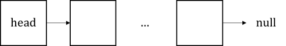
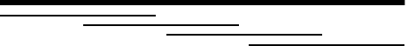
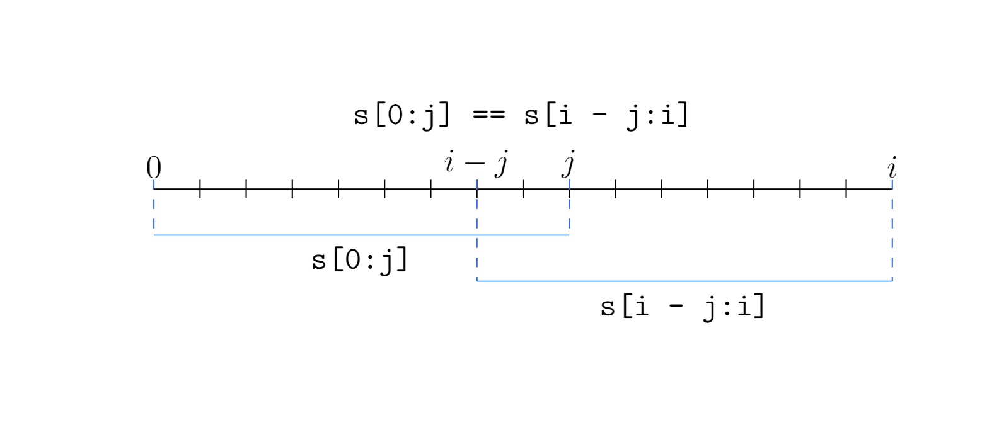
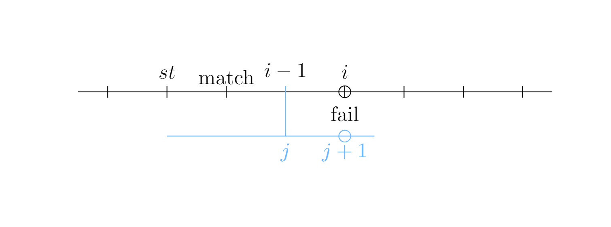

# Data Structure

## Linked List

- A head pointer is needed to point to the first node.
- Each node has two fields: `val` and `next`.
- The last node points to `NULL`.

  

### Struct-based Implementation

```cpp
struct Node {
    int val;
    Node* next;
    Node(int x) : val(x), next(NULL) {}
};
```

In order to create a linked list, we need to create a `Node` first. Then we can create a linked list by connecting these `Node`s.

```cpp
Node* head = new Node(1);
head->next = new Node(2);
head->next->next = new Node(3);
```

The above implementation is usually not recommended. Because the creation of new objects is expensive. In practice, where `1e6-1e7` nodes are needed, we should use `new` as less as possible. Hence, array-based implementation is usually preferred.

### Array-based Singly Linked List

- Create 2 Array
  - The first array, `e[N]`, stores the value of each node.
  - The second array, `ne[N]`, stores the index of the next node. Specifically, `-1` means `NULL`.
- The node's identifier is the index of the node in the array. For example, the head node point to `ne[0`]` with the value of `e`[0]`.

```cpp
class List {
    int head;   // index of the first element
    int e[N];   // value of the element
    int ne[N];  // index of the next element
    int idx;    // index of the next empty element

   public:
    List() {
        head = -1;
        idx = 0;
    }

    void prepend(int x) {
        e[idx] = x;
        ne[idx] = head;
        head = idx;
        idx++;
    }

    void insert(int k, int x) {
        e[idx] = x;
        ne[idx] = ne[k];
        ne[k] = idx;
        idx++;
    }

    void append(int x) {
        if (head == -1) {
            prepend(x);
            return;
        }
        int k = head;
        while (ne[k] != -1) k = ne[k];
        insert(k, x);
    }

    void remove(int k) {
        if (k == head) {
            head = ne[k];
            return;
        }
        ne[k] = ne[ne[k - 1]];
        // one may optimize this and reuse idx.
        // memory leak is ignored in algorithm questions.
    }

    void print() {
        for (int i = head; i != -1; i = ne[i]) cout << e[i] << ' ';
        cout << endl;
    }
};
```

### Array-based Doubly Linked List

- To improve the performance of a singly linked list, we can use a doubly linked list.
- In a doubly linked list, each node has two pointers: `prev` and `next`.
- In an array-based implementation, we will create 3 arrays: `e[N]`, `prev[N]`, and `next[N]`. For the sake of simplicity, let's say the head node is `0`.

<!-- TODO: Deal with code -->

```cpp
class List {
    int e[N];        // value of the element
    int l[N], r[N];  // the left and right pointer of the element
    int idx;         // index of the next empty element

   public:
    List() {
        // since head and tail take up two elements, we start from 2
        idx = 2;
        // head and tail are 0, 1
        r[0] = 1;
        l[1] = 0;
    }

    void insert(int k, int x) {
        e[idx] = x;
        r[idx] = r[k];
        l[idx] = k;
        l[r[k]] = idx;
        r[k] = idx;
    }

    void insert_left(int k, int x) { insert(l[k], x); }

    int remove(int k) {
        r[l[k]] = r[k];
        l[r[k]] = l[k];
        int result = e[k];
        e[k] = 0;
        return result;
    }

    void print() {
        for (int i = r[0]; i != 1; i = r[i]) cout << e[i] << ' ';
        cout << endl;
    }
};
```

## Stack & Queue

### Stack

- The stack is a LIFO (Last In First Out) data structure.

```cpp
int stk[N], tt;

void push(int x) { stk[++tt] = x; }
int pop() { return stk[tt--]; }
bool empty() { return tt == 0; }
int peek() { return stk[tt]; }
```

### Queue

- The queue is a FIFO (First In First Out) data structure.

```cpp
int q[N], hh, tt = -1;

void enqueue(int x) { q[++tt] = x; }
int dequeue() { return q[hh++]; }
bool empty() { return hh <= tt; }
int head() { return q[hh]; }
int tail() { return q[tt]; }
```

- The above implementation is not efficient. We can use a circular queue to improve performance. That is, reuse the space of the queue, rather than leaving empty spaces in front.

```cpp
int q[N], hh, tt = -1;

void enqueue(int x) {
    tt = (tt + 1) % N;
    q[tt] = x;
}

int dequeue() {
    int result = q[hh];
    hh = (hh + 1) % N;
    return result;
}

bool empty() { return hh == (tt + 1) % N; }
int head() { return q[hh]; }
int tail() { return q[tt]; }
```

## Monotonic Stack & Queue

Consider using stack and queue to emulate a rudimentary solution. Then, consider the constraints that are available for us to eliminate some elements in the stack or queue. If monotonicity is obtained, then we can use binary search, first, last, and all kinds of operations to speed up the process.

### Monotonic Stack

Given a sequence of numbers, we want to find the next number is the left or right that is larger or smaller than the current number. For now, let's assume we want to find the number on the left that is smaller than the current number.

- Rudimentary solution: $O(n^2)$

```cpp
for (int i = 0; i < n; i++) {
    int j = i + 1;
    while (j < n && a[j] <= a[i]) j++;
    if (j == n) cout << -1 << ' ';
    else cout << a[j] << ' ';
}
```

- Monotonic stack: $O(n)$
  - To find the next number that is smaller than the current number, we can use a stack to store all the numbers that were on the left of the current number. Then, we iterate through the stack (just, pop, pop, and pop) to find the next number that is smaller than the current number.
    - If the stack is empty, then no number is smaller than the current number.
    - Otherwise, the top of the stack is the next number that is smaller than the current number.
    - The reason that we can pop them, is because if `a`[i] >= aj` and `i < j`, then `a[i]` must not be the closest smaller number, as the `a[j]` that follows must be a more proper candidate.
  - Finally, put an `a[j]` into the stack for the next elements' comparison.

```cpp
#include <iostream>

using namespace std;

const int N = 1e6 + 10;
int stk[N], tt;

int main() {
    int n;
    cin >> n;

    for (int i = 0; i < n; i++) {
        int x;
        cin >> x;
        while (tt && stk[tt] >= x) tt--;
        if (tt)
            cout << stk[tt] << ' ';
        else
            cout << -1 << ' ';
        stk[++tt] = x;
    }

    return 0;
}
```

### Monotonic Queue

- Find the rolling max and min of a sequence of numbers (i.e., the max/min of a sliding window).

- Rudimentary solution: $O(nk)$

```cpp
int main() {
    int n, k;
    cin >> n >> k;
    int a[n];

    for (int i = 0; i < n; i++) cin >> a[i];
    for (int i = 0; i <= n - k; i++) {
        int res = -2e9;
        for (int j = i; j < i + k; j++) res = max(res, a[j]);
        cout << res << ' ';
    }
    return 0;
}
```

- If we use a monotonic queue, we can reduce the time complexity to $O(n)$.
  - Whenever a new element is added, we pop all the elements that are smaller than the new element.
  - Then, print out the first element of the queue, which is the max/min of the current window.

```cpp
#include <cstdio>
#include <iostream>

using namespace std;

const int N = 1e6 + 10;

int main() {
    int n, k;
    scanf("%d %d", &n, &k);

    int a[n] = {0};
    for (int i = 0; i < n; i++) scanf("%d", &a[i]);

    int q[n] = {0}, tt = -1, hh = 0;  // q stores the index of number in a
    for (int i = 0; i < n; i++) {
        if (hh <= tt && i - k + 1 > q[hh]) hh++;    // remove number last sliding window, if necessary
        while (hh <= tt && a[q[tt]] >= a[i]) tt--;  // ensure monotonicity. head is smallest
        q[++tt] = i;                                // put new number
        if (i >= k - 1) printf("%d ", a[q[hh]]);    // if enough number in here
    }
    puts("");
    tt = -1, hh = 0;
    for (int i = 0; i < n; i++) {
        if (hh <= tt && i - k + 1 > q[hh]) hh++;
        while (hh <= tt && a[q[tt]] <= a[i]) tt--;
        q[++tt] = i;
        if (i >= k - 1) printf("%d ", a[q[hh]]);
    }
    puts("");
    return 0;
}
```

## KMP

### Rudimentary Solution

- Brute force: $O(nm)$

```cpp
#include <iostream>

using namespace std;

bool isMatch(string s, string p) {
    int n = s.size(), m = p.size();
    for (int i = 0; i <= n - m; i++) { // enumerate all possible starting points
        bool match = true;
        for (int j = 0; j < m; j++) { // check if p matches s[i..i+m-1]
            if (s[i + j] != p[j]) {
                match = false;
                break;
            }
        }
        if (match) return true;
    }
    return false;
}

int main() {
    string s, p;
    cin >> s >> p;
    if (isMatch(s, p))
        cout << "Yes" << endl;
    else
        cout << "No" << endl;
    return 0;
}
```


  

- In the above solution, a lot of repetitive matching happened. For example, when we are matching `s[1..3]` and `p[1..3]`, we have already matched `s[1..2]` and `p[1..2]`. We can use this information to speed up the process.

### KMP

- KMP: $O(n+m)$
  - We can use a `next` array to store the information of the longest prefix that is also a suffix of the current string.
    - if `next[i] = j` and the string is `s`, then `s[0..j-1] = s[i-j..i-1]`.
    - 
  - With this information, when we start to match in the next loop, we will be confident that a certain part of the string has already been matched.
    - 

```cpp
#include <iostream>

using namespace std;

const int N = 1e5 + 10, M = 1e6 + 10;

int n, m;
char p[N], s[M];
int ne[N];  // shadows std::next

int main() {
    cin >> n >> p + 1 >> m >> s + 1;

    // find next
    for (int i = 2, j = 0; i <= n; i++) {
        while (j && p[i] != p[j + 1]) j = ne[j];
        if (p[i] == p[j + 1]) j++;
        ne[i] = j;
    }

    // match
    for (int i = 1, j = 0; i <= m; i++) {
        while (j && s[i] != p[j + 1]) j = ne[j];
        if (s[i] == p[j + 1]) j++;
        if (j == n) {
            // success
            printf("%d ", i - n);
            j = ne[j];
        }
    }

    return 0;
}
```

- In the above nested loop, `j`` will always be minus by at least 1. As there is at most `m` addition to `j`, the time complexity is $O(n+m)$.