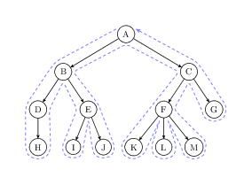
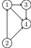
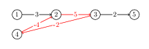

# Graph and Search

## Depth-first Search (DFS)

- Given a tree. DFS starts from the root.
  - For each node, visit its children.
  - If a node has no children, go back to its parent.
    - If a node has no parent, go back to its grandparent.
    - And so on



### Properties

- It will always come down to the leaf node, as much as possible.
- Use a `stack` to implement. It will only remember all the nodes in the path, using $O(N)$ spaces. One may as well use recursion to implement DFS, which will use $O(N)$ spaces in the call stack, regardless.
- It may not find the shortest path to reach a node.


### Example

#### Permute Numbers

```cpp
#include <iostream>

using namespace std;

const int N = 10;

int n;
int path[N];
bool used[N];

void dfs(int u) {
    if (u == n) {
        for (int i = 0; i < n; i++) cout << path[i] << " ";
        cout << endl;
    }
    for (int i = 0; i < n; i++)
        if (!used[i]) {
            path[u] = i + 1;
            used[i] = true;
            dfs(u + 1);
            used[i] = false;
        }
}

int main() {
    ios::sync_with_stdio(false), cin.tie(0), cout.tie(0);

    cin >> n;
    dfs(0);
    return 0;
}
```

- In the above code, we utilize the runtime stack to implement DFS.
- If we put a mapping after the `path` array, we can get the permutation of an arbitrary collection of numbers.

#### n-Queens

- Treat this as a permutation problem. Store 3-bit set, `col`, `dg` and `udg`, to record the status of each column, diagonal and anti-diagonal. Then we can use DFS to find all the solutions, that is, cut the possible children of the permutation tree dynamically in the DFS process, this is called **pruning**.

##### Column-wise DFS

- We are using `u + i` and `n - u + i` to store the status of the diagonal and anti-diagonal, respectively. This is because the y-intercept of the same diagonal is the same, and the y-intercept of the same anti-diagonal is the same --- $y = x + b$, then $b = y - x$. Plus `n` for the anti-diagonal, because the index of the array cannot be negative.

```cpp
#include <bitset>
#include <iostream>

using namespace std;

const int N = 9;

int n;
char q[N][N];
bitset<N> col;
bitset<2 * N> dg, udg;

void dfs(int u) {
    if (u == n) {
        for (int i = 0; i < n; i++) {
            for (int j = 0; j < n; j++) {
                cout << q[i][j];
                if (j < n - 1) cout << " ";
            }
            cout << endl;
        }
        cout << endl;
        return;
    }

    for (int i = 0; i < n; i++) {
        if (!col[i] && !dg[u + i] && !udg[n - u + i]) {
            q[u][i] = 'q';
            col[i] = dg[u + i] = udg[n - u + i] = 1;
            dfs(u + 1);
            col[i] = dg[u + i] = udg[n - u + i] = 0;
            q[u][i] = '.';
        }
    }
}

int main() {
    cin >> n;
    for (int i = 0; i < n; i++)
        for (int j = 0; j < n; j++)
            q[i][j] = '.';
    dfs(0);
    return 0;
}
```

##### Element-wise DFS

```cpp
#include <bitset>
#include <iostream>

using namespace std;

const int N = 9;

int n;
char q[N][N];
bitset<N * 2> dg, udg;
bitset<N> col, row;

void dfs(int x, int y, int s) {
    if (s == n) {
        for (int i = 0; i < n; i++) {
            for (int j = 0; j < n; j++) {
                cout << q[i][j];
            }
            cout << endl;
        }
        cout << endl;
        return;
    }

    for (int i = x; i < n; i++)
        for (int j = (i == x ? y : 0); j < n; j++)
            if (!row[i] && !col[j] && !dg[i + j] && !udg[n - i + j]) {
                q[i][j] = 'Q';
                row[i] = col[j] = dg[i + j] = udg[n - i + j] = 1;
                dfs(i, j + 1, s + 1);
                row[i] = col[j] = dg[i + j] = udg[n - i + j] = 0;
                q[i][j] = '.';
            }
}

int main() {
    cin >> n;
    for (int i = 0; i < n; i++)
        for (int j = 0; j < n; j++)
            q[i][j] = '.';
    dfs(0, 0, 0);
    return 0;
}
```

## Breadth-first Search (BFS)

- First, create a queue, and put the root node into it.
  - Iterate the first element in the queue, and put its children into the queue.
  - Whenever we iterate a node, the node is removed from the queue.
- When the queue is empty, we have finished the BFS.

### Properties

- It will check each node, layer by layer.
- Use a `queue` to implement. It will remember each layer's nodes. Hence, using $O(2^h)$ spaces, where $h$ is the height of the tree.
- It will always find the **shortest** path to reach a node (if the graph is unweighted).


### Example

#### Maze

Walk through the maze from the start point at (0,0) to the endpoint at (n-1, m-1). If one wants to store the path from the start point to the endpoint, we can use a `pre` array to store the previous node of each node. Then we can use the `pre` array to get the path.


```cpp
#include <cstring>
#include <iostream>

using namespace std;

typedef pair<int, int> PII;

const int N = 1e3 + 10;

int main() {
    ios::sync_with_stdio(false), cin.tie(nullptr), cout.tie(nullptr);

    int n, m;
    cin >> n >> m;

    int g[n][m];  // the maze, or the graph
    int d[n][m];  // the distance to the starting position
    memset(d, -1, sizeof d);
    d[0][0] = 0;

    for (int i = 0; i < n; i++)
        for (int j = 0; j < m; j++)
            cin >> g[i][j];

    PII q[n * m];
    int hh = 0, tt = -1;
    q[++tt] = {0, 0};
    int dx[4] = {-1, 0, 1, 0}, dy[4] = {0, 1, 0, -1};

    while (hh <= tt) {
        auto t = q[hh++];
        for (int i = 0; i < 4; i++) {
            int x = t.first + dx[i], y = t.second + dy[i];
            if (x >= 0 && x < n && y >= 0 && y < m  // can walk
                && !g[x][y]                         // not wall
                && d[x][y] == -1                    // and haven't reached yet
            ) {
                d[x][y] = d[t.first][t.second] + 1;
                q[++tt] = {x, y};
            }
        }
    }

    cout << d[n - 1][m - 1] << endl;

    return 0;
}
```

## Storage

- The tree is a special graph, which has no cycle.
- Therefore, we shall store the tree in the same manner as the graph.
- An undirected graph is a special case of a directed graph. Hence, we can store the undirected graph in the same manner as the **directed graph**.


### Adjacency Matrix

- Store the graph in a $n \times n$ matrix.
- Usually not used in practice, because it is not space-efficient, especially for the sparse graph. Further, it does not support the storage of multiple edges. Use when **the graph is dense**.

```cpp
#include <iostream>

using namespace std;

int graph[10][10]; // number can be weight, or 0/1 indicate whether there is an edge

int main() {
    int n, m;
    cin >> n >> m;

    for (int i = 0; i < m; i++) {
        int a, b;
        cin >> a >> b;
        // there is an edge from a to b
        graph[a][b] = graph[b][a] = 1;
    }

    return 0;
}
```


### Adjacency List

- An array of linked lists' heads is called the **adjacency list**.

For example, the following graph



can be stored as

```cpp
{
    1: 3 -> 4 -> NULL,
    2: 1 -> 4 -> NULL,
    3: 4 -> NULL,
    4 -> NULL
}
```

- The space complexity is $O(m)$, where $m$ is the number of edges. When we need to insert a new edge, we can do it in $O(1)$ time, by inserting it at the head of the linked list. The expense is that we need to traverse the linked list to find the edge. Use when the graph is **sparse**.

```cpp
#include <cstring>
#include <iostream>

using namespace std;

const int N = 1e6 + 10;
const int M = N * 2;

// 2 edges. hence, N * 2 elements in the linked list
int h[N], e[M], ne[M], idx;  // one may use vector to store as well. However, that's slow.

void add(int a, int b) {
    e[idx] = b;
    ne[idx] = h[a];
    h[a] = idx++;
}

void add_undirection(int a, int b) {
    add(a, b);
    add(b, a);
}

void remove(int a, int b) {
    int i = h[a];
    while (i != -1) {
        if (e[i] == b) {
            ne[i] = ne[ne[i]];
            break;
        }
        i = ne[i];
    }
}

void remove_undirection(int a, int b) {
    remove(a, b);
    remove(b, a);
}

int main() {
    // necessary init
    memset(h, -1, sizeof h);
    return 0;
}
```

## Depth-first & Breath-first Iteration

### Depth-first Iteration

- It will iterate as many children as possible and then go back to the parent node. In each iteration, it will mark a node as visited, because, in the graph, there may be cycles.

```cpp
bool seen[N];

// memset(seen, 0, sizeof seen); (don't forgot!)
void dfs(int u) {
    seen[u] = true;
    for (int i = h[u]; i != -1; i = ne[i]) {  // iterate all the neighbors of u
        int j = e[i];
        if (!seen[j]) {  // if the neighbor is not visited
            dfs(j);      // visit it
        }
    }
}
```

### Breath-first Iteration

- It will iterate the nodes layer by layer. In each iteration, it will mark a node as visited, because, in the graph, there may be cycles.

```cpp
bool seen[N];

void bfs(int u) {
    memset(seen, 0, sizeof seen);
    queue<int> q;  // queue to store the nodes to be visited
    q.push(u);     // push the starting node
    seen[u] = true;
    while (!q.empty()) {
        int t = q.front();
        q.pop();
        for (int i = h[t]; i != -1; i = ne[i]) {  // iterate all the neighbors of t
            int j = e[i];
            if (!seen[j]) {
                q.push(j);
                seen[j] = true;
            }
        }
    }
}
```

### Example

#### The gravity center of a tree

```cpp
#include <iostream>
#include <cstring>

using namespace std;

const int N = 1e6 + 10;
const int M = N << 1;

int n;
int h[N], e[M], ne[M], idx;
bool st[N];

int ans = N;

void add(int a, int b) {
    e[idx] = b;
    ne[idx] = h[a];
    h[a] = idx++;
}

// the number of nodes in the u as a root
int dfs(int u) {
    st[u] = true;

    int sum = 1, res = 0;
    for (int i = h[u]; i != -1; i = ne[i]) {
        int j = e[i];
        if (!st[j]) {
            int s = dfs(j);
            res = max(res, s);
            sum += s;
        }
    }

    res = max(res, n - sum);
    ans = min(ans, res);
    return sum;
}

// IO
int main() {
    cin >> n;
    memset(h, -1, sizeof h);
    for (int i = 0; i < n - 1; i++) {
        int a, b;
        cin >> a >> b;
        add(a, b), add(b, a);
    }

    dfs(1);
    cout << ans << endl;
    return 0;
}
```

#### Topological sort

- This is for a directed acyclic graph (DAG). It is a linear ordering of vertices such that for every directed edge `u -> v`, `u` comes before `v` in the ordering.
  - If there is a cycle, then there is no topological sort. You just can't expand it in a linear order.
- Start from a node that has no incoming edges, i.e., **in-degree** is 0. Move all that kinds of nodes into a queue. Then, BFS the graph, using the previous queue as the starting point. For each:
  - Remove the edge from the current node to its neighbor.
  - If the neighbor has no incoming edges, i.e., **in-degree** is 0, then add it to the queue.
- If there is a cycle, then the queue will be empty before all the edges are removed (in below, `tt != n - 1`).

```cpp
#include <cstring>
#include <iostream>

using namespace std;

const int N = 1e6 + 10;

int n, m;
int h[N], e[N], ne[N], idx;
int q[N], d[N];

void add(int a, int b) {
    e[idx] = b;
    ne[idx] = h[a];
    h[a] = idx++;
    d[b]++;
}

bool topsort() {
    int hh = 0, tt = -1;
    for (int i = 1; i <= n; i++)
        if (!d[i]) q[++tt] = i;

    while (hh <= tt) {
        int t = q[hh++];
        for (int i = h[t]; i != -1; i = ne[i]) {
            int j = e[i];
            d[j]--;
            if (!d[j]) q[++tt] = j;
        }
    }

    return tt == n - 1;  // all the points goes into the queue
}

int main() {
    ios::sync_with_stdio(false), cin.tie(nullptr), cout.tie(nullptr);

    memset(h, -1, sizeof h);

    cin >> n >> m;
    for (int i = 0; i < m; i++) {
        int a, b;
        cin >> a >> b;
        add(a, b);
    }

    if (topsort())
        for (int i = 0; i < n; i++) cout << q[i] << " ";
    else
        cout << -1;
    cout << endl;

    return 0;
}
```

## Shortest Path

### Choice of Algorithm

- In the following discussion, we will say $n$ is the number of nodes, and $m$ is the number of edges.
- There are different types of shortest paths:
  - Single source
    - The shortest path from a single node to another single node.
    - If all weights are positive, then we can use **plain Dijkstra's algorithm** ($O(N^2)$) or **heap-based Dijkstra's algorithm** ($O(m\log m)$).
      - Hence, the plain Dijkstra is better for dense graphs (when $n \le 10^5$), and the heap-based Dijkstra is better for sparse graphs (when $m \ge 10^5$).
      - A dense graph is defined as a graph where $m \sim n^2$, and a sparse graph is defined as a graph where $m \sim n$. It's just how many edges there are compared to the number of nodes.
    - If some weights are negative, then we can use the **Bellman-Ford algorithm** ($O(mn)$) and **SPFA algorithm** (average: $O(m)$, worst: $O(mn)$).
      - SPFA won't work if there is an upper bound on the number of edges. For the majority of the problems, SPFA is better than Bellman-Ford.
  - Multiple sources
    - The shortest path from multiple nodes to another single node.
    - We can use the **Floyd-Warshall algorithm** ($O(n^3)$).
- The main difficulty of shortest path problems is to abstract the problem into a graph. Why the algorithm works and the proof is, however, negligible.

### Plain Dijkstra's Algorithm

The plain Dijkstra's algorithm is greedy. It is used to find the shortest path from a single node to all other nodes.

The procedure is as follows:
1. Initialize `dst[1]` to 0, and all other `dst[i]` to infinity, or `INT_MAX`.
2. Let the node that has already been visited by `S` (i.e., the shortest distance has already been determined) and the node that has not been visited by `U`.
3. For each node in `U`, find the node with the minimum distance, and add it to `S`. 
4. Use this node to update the distance of all the nodes in `U`.  Basically, just see if the distance of the current node plus the distance from the current node to the neighbor is smaller than the current distance of the neighbor. If so, update it.
5. After `S` contains all the nodes, we can determine the shortest distance from the source node to all other nodes.

```cpp
#include <cstring>
#include <iostream>

using namespace std;

const int N = 510;
const int INF = 0x3f3f3f3f;
int n, m;
int g[N][N];  // dense, use adj mat
int dst[N];
bool st[N];

int dijkstra() {
    memset(dst, INF & 0xff, sizeof dst);
    dst[1] = 0;

    for (int i = 0; i < n; i++) {
        // find min distance node
        int t = -1;
        for (int j = 1; j <= n; j++)
            if (!st[j] && (t == -1 || dst[t] > dst[j]))
                t = j;
        st[t] = true;

        // optimize
        if (t == n) break;

        // update the distance
        for (int j = 1; j <= n; j++)
            dst[j] = min(dst[j], dst[t] + g[t][j]);
    }

    if (dst[n] == INF) return -1;
    return dst[n];
}

int main() {
    ios::sync_with_stdio(false), cin.tie(nullptr), cout.tie(nullptr);

    cin >> n >> m;
    memset(g, INF & 0xff, sizeof g);  // init all to infinity

    while (m--) {
        int a, b, c;
        cin >> a >> b >> c;
        g[a][b] = min(g[a][b], c);
    }
    cout << dijkstra() << endl;
    return 0;
}
```

### Heap-based Dijkstra's Algorithm

The heap-based Dijkstra's algorithm is also greedy. It simply finds of minimum node quicker by using a heap.

In the original implementation, finding min takes $n^2$ array access. Other operations like updating and marking, take $n$ and $m$ array access (in the worst-case scenario). Therefore, to speed up this algorithm, we can use a heap to find the minimum node in $n$ time, while making the update operation take $m \log n$ time.
- If we write the heap by hand and maintain a mapping relationship of the n-th inserted node and the index of the heap, then we can update the heap in $O(\log n)$ time.
- However, if we use the priority queue in the STL, then we can only update the heap in $O(\log m)$ time. This is because we can't modify arbitrary elements in the heap, and we can only modify the top element. Hence, we simply insert new elements without modifying the old ones. Since $m \ge n^2$ when we use this algorithm, it doesn't matter much---it's just a bunch of duplicated and wasted space.

```cpp
#include <cstring>
#include <iostream>
#include <queue>
#include <vector>

using namespace std;

typedef pair<int, int> PII;

const int N = 510;
const int INF = 0x3f3f3f3f;

int n, m;
int h[N], e[N], ne[N], w[N], idx;
bool st[N];
int dst[N];

void add(int a, int b, int c) {
    e[idx] = b;
    w[idx] = c;
    ne[idx] = h[a];
    h[a] = idx++;
}

int djikstra() {
    memset(dst, INF & 0xff, sizeof dst);
    dst[1] = 0;

    priority_queue<PII, vector<PII>, greater<PII>> p;
    p.push({0, 1});

    while (!p.empty()) {
        auto t = p.top();
        p.pop();

        int d = t.first, i = t.second;
        if (st[i]) continue;  // already been processed. duplication in queue
        for (int j = h[i]; j != -1; j = ne[j]) {
            int k = e[j];
            if (dst[k] > d + w[j]) {
                dst[k] = d + w[j];
                p.push({dst[k], k});
            }
        }

        st[i] = true;
    }

    if (dst[n] == INF) return -1;
    return dst[n];
}

int main() {
    ios::sync_with_stdio(false), cin.tie(nullptr), cout.tie(nullptr);

    memset(h, -1, sizeof h);
    cin >> n >> m;
    while (m--) {
        int a, b, c;
        cin >> a >> b >> c;
        add(a, b, c);  // duplicated elements don't need to be handled, because
        // the adjacent list.
    }

    cout << djikstra() << endl;
    return 0;
}
```


### Bellman-Ford Algorithm

The Bellman-Ford algorithm is a dynamic programming algorithm. It is used to find the shortest path from a single node to all other nodes.

It works as follows:
1. Iterate for $n$ times
   1. In each iteration, iterate each edge as a tuple `(a, b, w)`, representing there is an edge from `a` to `b` with weight `w`.
   > Because of that, one may store the graph as a list of struct. Adjacent matrix and list will do the same thing.
      1. For each edge, update the distance of `b` if `dst[a] + w < dst[b]`. If going from other nodes to `a` and then going from `a`` to `b` is shorter than the current distance of `b`, then update it.
   2. In `k`-th iteration, the number in `dst` array represents the shortest distance from the source node to all other nodes in at most `k` edges.
      1. Hence, in `n + 1`-th iteration, if any node's distance is updated, then there is a negative cycle in the graph.

After those 2 nested loops, `dst[b] <= dst[a] + w` holds for all edges. Therefore, the shortest path from the source node to all other nodes is determined.

Bellman-Ford algorithm can handle the situation when the weights of the edges are negative. However, it can't handle the situation when there is a negative cycle in the graph. 



- In the above figure, whenever we walk around the negative cycle marked in red, the distance from 1 to 5 gets decreased by 1. Therefore, the shortest path from 1 to 5 is negative infinity. Bellman-Ford algorithm can handle this situation, as mentioned above.
  - However, it is usually not used to find the negative cycle.
  - Further, the existence of a negative cycle doesn't mean that the shortest path doesn't exist. It just means that for some nodes, where it necessarily goes through the negative cycle, the shortest path is negative infinity and thus doesn't exist.
- $O(nm)$

```cpp
#include <cstring>
#include <iostream>

using namespace std;

const int N = 510, M = 10010, INF = 0x3f3f3f3f;

int n, m, k;
int dst[N], backup[N];

struct Edge {
    int a;
    int b;
    int w;
} edges[M];

bool bellman_ford() {
    memset(dst, INF & 0xff, sizeof dst);
    dst[1] = 0;

    for (int i = 0; i < k; i++) {
        /* Backup the distance array before the iteration. MEMSET is quick! */
        memcpy(backup, dst, sizeof dst);
        /* because of limitation of k, there is a chance that a successive edges
           will be iterated, and more than k node's path which is shortest got
           selected. Hence, only use the result from previous step */
        for (int j = 0; j < m; j++) {
            Edge e = edges[j];
            int a = e.a, b = e.b, w = e.w;
            dst[b] = min(dst[b], backup[a] + w);
        }
    }

    return dst[n] <= INF / 2;
}

int main() {
    ios::sync_with_stdio(false), cin.tie(nullptr), cout.tie(nullptr);

    cin >> n >> m >> k;
    for (int i = 0; i < m; i++) {
        int a, b, w;
        cin >> a >> b >> w;
        edges[i] = {a, b, w};
    }

    if (!bellman_ford())
        cout << "impossible";
    else
        cout << dst[n];
    cout << endl;
    return 0;
}
```


### SPFA Algorithm

SPFA is a variant of the Bellman-Ford algorithm. It is used to find the shortest path from a single node to all other nodes. It **does not** work on a negative cycle (lead to infinite loop). However, more than $99\%$ of the graphs don't have a negative cycle and SPFA usually yields better performance than Bellman-Ford. Therefore, SPFA is usually used in practice.

It works as follows:
1. Put the updated node into the queue.
2. Iterate edges in a BFS manner. 
  1. Get the node from the queue (although one may use the stack, priority_queue, and anything else)
  2. Iterate all the edges from the node. Only the nodes that are updated will be put into the queue. Maintain an array `st`, which indicates whether a node is in the queue or not. If the node already exists in the queue, then don't put it into the queue again.
  > The rough idea is, only the node whose distance get updated will lead to a update of the distance of its neighbors.

```cpp
#include <bitset>
#include <cstring>
#include <iostream>
#include <queue>

using namespace std;

const int N = 1e5 + 10, M = 1e5 + 10, INF = 0x3f3f3f3f;
int n, m;
int h[N], e[M], ne[M], w[M], idx;
int dst[N];
bitset<N> st;

void add(int a, int b, int wt) {
    e[idx] = b;
    w[idx] = wt;
    ne[idx] = h[a];
    h[a] = idx++;
}

bool spfa() {
    memset(dst, INF & 0xff, sizeof dst);
    dst[1] = 0;

    queue<int> q;
    q.push(1);
    st[1] = true;

    while (!q.empty()) {
        int t = q.front();
        q.pop();

        st[t] = 0; // one may put it back again

        for (int i = h[t]; i != -1; i = ne[i]) {
            int j = e[i];
            int alt_dst = dst[t] + w[i];
            if (alt_dst < dst[j]) {
                dst[j] = alt_dst;
                if (!st[j]) q.push(j);
                st[j] = 1;
            }
        }
    }

    return dst[n] <= INF / 2;
}

int main() {
    ios::sync_with_stdio(false), cin.tie(nullptr), cout.tie(nullptr);
    memset(h, -1, sizeof h);

    cin >> n >> m;
    for (int i = 0; i < m; i++) {
        int a, b, w;
        cin >> a >> b >> w;
        add(a, b, w);
    }

    if (spfa())
        cout << dst[n];
    else
        cout << "impossible";
    cout << endl;
    return 0;
}
```

#### Detect Negative Cycle

If we want to use SPFA to detect a negative cycle, we can use the following method:
1. Create an array `cnt` to record the number of times a node is put into the queue.
2. Whenever a node is put into the queue, increase the `cnt` by 1.
3. When the `cnt` of a node is greater than $n$, then there is a negative cycle. We are confident this is not a cycle alone, because otherwise, it wouldn't be put into the queue again.

```cpp
#include <cstring>
#include <iostream>
#include <queue>

using namespace std;

const int N = 1e5 + 10;
const int INF = 0x3f3f3f3f;

int n, m;
int h[N], e[N], ne[N], w[N], idx;
int dst[N], cnt[N];
bool st[N];

void add(int a, int b, int c) {
    e[idx] = b,
    w[idx] = c,
    ne[idx] = h[a],
    h[a] = idx++;
}

int spfa() {
    queue<int> q;
    // notice we didn't memset dst to INF, because if there is a negative cycle,
    // dst will be updated regardless.

    // all the node can be the start point
    for (int i = 1; i <= n; i++) {
        q.push(i);
        st[i] = true;
    }

    // then, bfs
    while (!q.empty()) {
        int t = q.front();
        q.pop();
        st[t] = false;

        for (int i = h[t]; i != -1; i = ne[i]) {
            int j = e[i];
            if (dst[j] > dst[t] + w[i]) {
                dst[j] = dst[t] + w[i];
                // by pigeonhole principle, if cnt[j] > n, there must be a
                // negative cycle
                if ((cnt[j] = cnt[t] + 1) >= n) return true;
                if (!st[j]) {
                    q.push(j);
                    st[j] = true;
                }
            }
        }
    }

    return false;
}

int main() {
    ios::sync_with_stdio(false), cin.tie(nullptr), cout.tie(nullptr);
    memset(h, -1, sizeof h);

    cin >> n >> m;
    for (int i = 0; i < m; i++) {
        int a, b, c;
        cin >> a >> b >> c;
        add(a, b, c);
    }

    if (spfa()) cout << "Yes" << endl;
    else cout << "No" << endl;

    return 0;
}
```


### Floyd-Warshall Algorithm